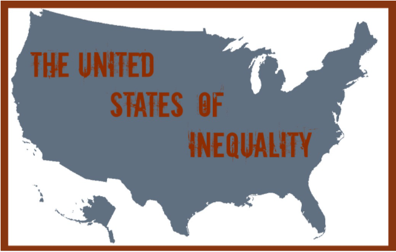

```{r setup, echo=FALSE, results='hide', message=FALSE, warning=FALSE}
knitr::opts_chunk$set(
	echo = FALSE,
	message = FALSE,
	warning = FALSE
)
# Uvoz vseh potrebnih knjižnic
source("lib/libraries.r", encoding="UTF-8")

```

```{r rstudio, results='asis'}
# Izris povezave do RStudia na Binderju
source("lib/rstudio.r", encoding="UTF-8")
```

# Izbira teme

Analizirali bomo plače v ZDA skozi leta, analizirali bomo kateri poklici so najbolje in kateri najslabše plačani ter
ugotavljali katere zvezne države imajo najboljše pogoje za delavce in katere najslabše ter kako je to 
povezano z njihovim BDP. 
Na koncu bomo poskusili naraditi večjo makroekonomsko analizo vseh pridobljenih podatkov, 
da bi ugotovili dejansko stanje ZDA. 

Podatki so bili zbrani:

1. iz Ameriškega statističnega urada ([U.S. BUREAU OF LABOR STATISTICS](http://www.bls.gov/bls/proghome.htm)) v CSV formatu. 

2. Tabela o informacijah o BDP per capita zveznih držav - pa je bila uvožena iz wikipedije:
 https://en.wikipedia.org/wiki/List_of_U.S._states_and_territories_by_GDP_per_capita

<center>


</center>

***

# Obdelava, uvoz in čiščenje podatkov

```{r uvoz}
source("uvoz/uvoz.r", encoding="UTF-8")
```


V drugi fazi smo tabele prečistili tako, da so v formatu *tidy data*.

Podatke imamo v tabelah:

Pri sklop podatkov se nanašajo na national data:

1. `kode` je razpredelnica z eno dimenzijo: 
  - `occ_code` - spremenljivka: predstavlja kodo poklica (vsak poklic ima enolično določeno kodo poklica)
  - `occ_title`- meritev: naziv poklica, ki je odvisen od kode 

2. `t_e` je razpredelnica z dvema dimenzijama:
  - `leto` - spremenljivka: leto meritve (od 2006 do 2019)
  - `occ_code` - spremenljivka: predstavlja kodo poklica 
  - `emp` - meritev: število zaposlenih delavcev
  
3. `nat.ha` je razpredelnica s tremi dimenzijami:
  - `leto` - spremenljivka: leto meritve (od 2006 do 2019)
  - `occ_code` - spremenljivka: predstavlja kodo poklica 
  - `sredina` - spremenljivka: tip sredine (povprečje - mean, mediana - median)
  - `h` - meritev: urna postavka plač
  - `a` - meritev: letna meritev plač

Drugi sklop podatkov se nanašajo na state data:

1. `t_e_s` je razpredelnica s tremi dimenzijami
  - `leto` - spremenljivka: leto meritve (od 2006 do 2019)
  - `state` - spremenljivka: zvezne države ZDA
  - `occ_code` - spremenljivka: predstavlja kodo poklica 
  - `emp` - meritev: število zaposlenih delavcev

2. `st.ha` je razpredelnica s štirimi dimenzijami
  - `occ_code` - spremenljivka: predstavlja kodo poklica 
  - `leto` - spremenljivka: leto meritve (od 2006 do 2019)
  - `state` - spremenljivka: zvezne države ZDA
  - `sredina` - spremenljivka: tip sredine (povprečje - mean, mediana - median)
  - `h` - meritev: urna postavka plač
  - `a` - meritev: letna meritev plač  
  
Tretji podatki so pobrani iz Wikipedije:

1. `GDP_by_state` je razpredelnica z dvema dimenzijama
  - `State` - spremenljivka: zvezne države ZDA  
  - `leto` - spremenljivka: leto meritve (od 2006 do 2019)
  - `GDP` - meritev: BDP per capita 

***

# Vizualizacija podatkov

```{r vizualizacija, echo=FALSE, message=FALSE, warning=FALSE, results='hide'}
source("vizualizacija/vizualizacija.r", encoding="UTF-8")
```

Prvi graf prikazuje zaposlenost po letih v ZDA. 

```{r graf1, echo=FALSE, fig.align='center'}
graf1
```

Čeprav je graf enostaven se iz njega, da dosti razbrati. Vidimo, da zaposlenost v ZDA narašča do leta 2008, nato pa drastično pade, kar je sevda posledica makroekonomske finančne zadolžitvene krize, ki se je takrat začela v ZDA. Zaposlenost se ponovno začne višati v letih po 2010 in je leta 2018 najvišja. To nam daje dober znak za prihodnjo gospodarstvo države, saj bi morda tako mislili, da bo še naprej več ljudji delalo in bo tako vedno manj brezposelnosti. Lahko bi si pa mislili tudi, da bo v bližnji prihodnosti ponovno makroekonomska kriza, saj se te pojavljamo na vsakih cca. 8 do 10 let in bi zato ponovno pričakovali padec gospodarstva. Torej iz grafa samega in brez dodatnih informacij o ostalih makroekonomskih kazalcih bi težko napovedali, kaj se bo zgodilo v prihodnjih letih. Več o tem bomo spregovorili tudi kasneje. Grafu sem tudi dodal model po metode najmanjših kvadratov, to pa predvsem zato ker sem želel izpostaviti, da če bi modelirali s to metodo nas bi to najverjetneje zavelo in nas pripreljalo do nesmiselnih rezultatov. 


Graf prikazuje porazdelitec plač v ZDA za najboljše plačane tri poklice (po 
urni postavki). 

```{r graf2, echo=FALSE, fig.align='center'}
graf2
```

Klučno opažanje iz teh treh svečk je to, da so najboljše plačeni poklici vedno dobro plačani in pa da je odstopanje od povprečja dokaj majhno. Torej boljše blačani poklici so stalno boljše plačani. Trend za posamezen poklic si bomo pa bolj natančne ogledali v naslednjem grafu.


Graf prikazuje urne postavke plač najboljše plačanih poklicev v ZDA in kako se 
spreminjajo čez leta. 

```{r graf3, echo=FALSE, fig.align='center'}
graf3
```

Iz grafa je razvidno, da se plače boljše blačanih poklicev konstantno večjo. Izjema so tu 
ortodonti, katerim se plača med krizo zmanjša potem pa se spet začne rasti. Na 
druga dva poklici pa kriza ni vplivala, ampak se je takrat kar povečala, kar me je 
malo presenetilo. 


Graf prikazuje plače od štirih najslabše plačanih poklicev v ZDA in kako se 
spreminjajo čez leta.

```{r graf4, echo=FALSE, fig.align='center'}
graf4
```
Lahko opazimo podoben trend o najprejšnem zviševanju plač potem pa pri večini poklicem
v časovnem obdobju od 2010 do 2015. Pomivalci posod so tudaj izjema, saj se jim 
plača konstano veča. Posebaj zanimivo mi je, da so se plače natakarjev in natakaric v 
zadnjih letih dratično večale v primerjavi s prejšnimi leti. Prav ti predstavljajo 
velik del zaposlitvene sile, kot bomo videli v naslednjem grafu, in v ZDA predstavljajo
velik problem "tipping-a". 


Graf prikazuje deleže poklicev t.j. boljše in slabše plačenih. 

```{r graf5, echo=FALSE, fig.align='center'}
graf5
```

Iz grafa je zelo očitno, da največji delež predstavljajo slabše plačeni poklici, pri tem vodijo natakarji in natakarice ter pomivalci posod. Zelo majgen delež dejansko predstavljajo dobro plačani poklci, kar vodi do zelo velike neenakosti plač, kot tudi implicira slika na začetku poročila.


```{r graf6, echo=FALSE, fig.align='center'}
graf6
```

Iz grafa je razvidno, da se je do krize število slabše plačani poklicev večalo, dobro plačanih pa je ostalo priblizno isto.
Po krizi se je število slabše plačanih zmanjšalo, medtem ko je število dobro plačanih ostalo enako. Po krizi pa zopet
vidimo enak trend kot pred krize, torej da se število slabših plačanih poklicev veča. To lahko predstavi
problem za državo, saj pride do velike neenakosti v plačah.


Zemljevid predstavlja povprečno plačo po zveznih državah. 

```{r zem1, echo=FALSE, fig.align='center'}
zem1
```
 
Iz zemlejevida se vidi katere države imajo najboljšo povprečno plačo. Tu npr. izstopajo Aljaska, Kalifornija in Washingtom. V negativnem pa npr. Montana, Oklahoma in Arkansas. Tu se lepo vidi tudi neenakost med zveznimi državami v ZDA.  

***

# Analiza 

```{r analiza, echo=FALSE, message=FALSE, warning=FALSE}
source("analiza/analiza.r", encoding = "UTF-8")
```

V razdelku analize si bomo pogledali zelo enostaven primer predikcije, kako bo 
z BDP per capita v zvezni državi Alaski v naslednjih letih. 


```{r regression, echo=FALSE, fig.align='center'}
regression
```

Najprej smo izračunali kako naj bi bilo z BDP per capita v naslednjih letih s 
pomočjo kvadratične odvisnosti spremenljivk v prejšnjih letih. Ugotovili smo, da 
naj bi iz teh podatkov se v naslednjih letih BDP per capita znižal, kar je tudi
v skladu, kar se je dejansko zgodilo, a se je tu znižal več kot pa se bi dejansko 
moral. Problem je seveda v tem, da smo upošteval, da naj bi bil BDP per capita odvisen
le od leta, kar pa seveda ni res. Useeno pa za leto 2019 napoved ni tako slaba.


***

# Shiny 

```{r shiny, echo=FALSE}
shinyAppDir("shiny", options=list(width="100%", height=600))
```

S pomočjo shiny-ja lahko boljše analiziramo nekatere dejavike, ki smo jih prej že obravnavali. Prvi tab nam prikazuje porazdelitev plač v ZDA. Vidimo, da je večina plač v nižjem delu (urne postavke od 10-30), medtem ko je višje plačanih plač bistveno manj. Tu ponovno vidimo neenakost med poklici.

Drugi tab predstavlja analizo plač glede na država in glede na leto. Vidimo, da se plače z leti povprečno nekoliko večejo, saj se pravokotniki v povprečju nekoliko gibljejo navzgor.

Tretji tab primerja BDP per capita v izbrani zvezni državi in BDP per capita v ZDA. Ter kaže primerjavo urnih postavk. Načeloma je trend, da če je BDP per capita v zvezni državi višji, so višje tudi povprečne plače in obratno, sicer pride tudi no nekaterih odstopanj, npr. Virginia se ne drži tega pravila, a izjeme ponavadi samo potrjujejo pravilo.

Četrti tab kaže analizo sredin plač (v urah in letno). Načeloma so prvi štirji grafi podobni v smislu, da če imajo države visoko povprečno urno postavko bodo imele tudi viskoko letno plačo. Hudih odstopanj tudkaj ni. Zanimiva mi pa je zaposlenost v ZDA, najvišja zaposlenost je v Kaliforniji, to je morda zato, ker so tam najboljši pogoji za življenje, saj smo opazili že pri analizi prejšnjega zemljevida, da so tam visoke povprečne plače.


