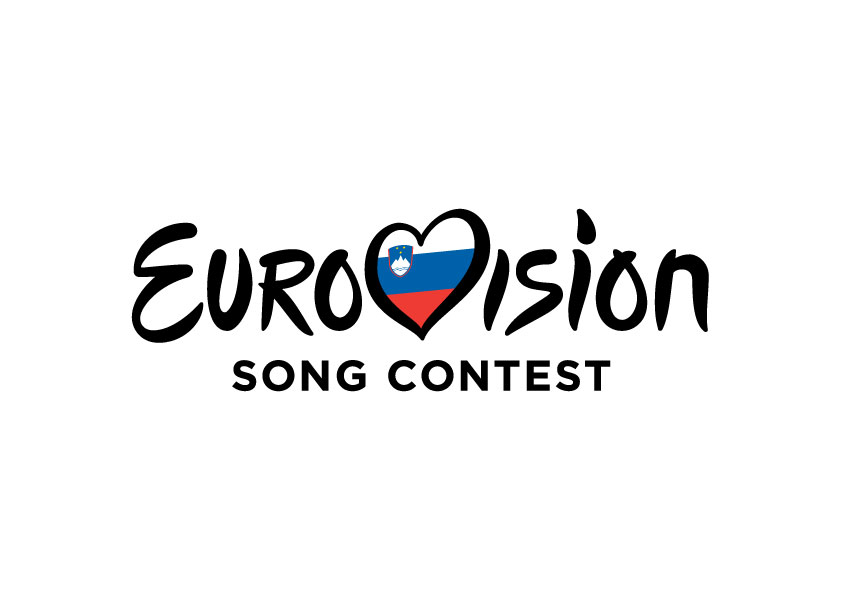

```{r setup, echo=FALSE, results='hide', message=FALSE, warning=FALSE}
knitr::opts_chunk$set(echo=FALSE, message=FALSE, warning=FALSE)

# Uvoz vseh potrebnih knjižnic
source("lib/libraries.r", encoding="UTF-8")
```

```{r rstudio, results='asis'}
# Izris povezave do RStudia na Binderju
source("lib/rstudio.r", encoding="UTF-8")
```


# Izbira teme

Pri projektu me je zanimalo, kako Slovenija glasuje na tekmovanju za Pesem Evrovizije. Poleg tega sem vzporedno analizirala tudi, kako je v preteklosti glasovala Jugoslavija.



***

# Obdelava, uvoz in čiščenje podatkov

```{r uvoz}
source("uvoz/uvoz.r", encoding="UTF-8")
```

Podatke sem uvažala z uradne strani tekmovanja "Eurovision TV", eno tabelo pa s strani, ki vodi statistiko, povezano s tekmovanjem. Imam 6 glavnih tabel.

1. `tabela1` - podatki o nastopih Jugoslavije
  - `KRAJ` - spremenljivka: mesto tekmovanja,
  - `LETO` - spremenljivka: leto tekmovanja (1961-1992, brez določenih let vmes),
  - `NASTOPAJOCI` - spremenljivka: ime izvajalca, ki nas je zastopal,
  - `NASLOV_PESMI` - spremenljivka: naslov pesmi, ki jo je izvajalec pel,
  - `TOCKE` - spremenljivka: število prejetih točk,
  - `UVRSTITEV` - spremenljivka: zasedeno končno mesto.

2. `tabela2` - podatki o nastopih Slovenije
  - `KRAJ` - spremenljivka: mesto tekmovanja,
  - `LETO` - spremenljivka: leto tekmovanja (1993-2019, brez let 1994 in 2000),
  - `NASTOPAJOCI` - spremenljivka: ime izvajalca, ki nas je zastopal,
  - `NASLOV_PESMI` - spremenljivka: naslov pesmi, ki jo je izvajalec pel,
  - `TOCKE` - spremenljivka: število prejetih točk,
  - `UVRSTITEV` - spremenljivka: zasedeno končno mesto v finalu ali polfinalu.

3. `tabela3` - podatki o glasovanju Jugoslavije
  - `Kraj` - spremenljivka: mesto tekmovanja,
  - `Leto` - spremenljivka: leto tekmovanja (1961-1992, brez določenih let vmes),
  - `Drzava` - spremenljivka: drzava, ki je kadarkoli nastopila na tekmovanju,
  - `Tocke` - spremenljivka: število točk, ki smo jih podelili posamezni državi

4. `tabela4` - podatki o glasovanju Slovenije
  - `Kraj` - spremenljivka: mesto tekmovanja,
  - `Leto` - spremenljivka: leto tekmovanja (1993-2019, brez let 1994 in 2000),
  - `Drzava` - spremenljivka: drzava, ki je kadarkoli nastopila na tekmovanju,
  - `Tocke` - spremenljivka: število točk, ki smo jih podelili posamezni državi


5. `tabela5` - podatki o glasovanju Slovenije
  - `Drzava` - spremenljivka: drzava, ki je kadarkoli nastopila na tekmovanju,
  - `Stevilo_nastopov` - spremenljivka: število vseh nastopov posamezne države,
  - `Prvi_nastop` - spremenljivka: letnica prvega nastopa države.

6. `pod_zmagovalci` - tabela zmagovalcev tekmovanja od leta 1956 do 2019
  - `Drzava` - spremenljivka: drzava, ki je kadarkoli nastopila na tekmovanju,
  - `Stevilo_nastopov` - spremenljivka: število vseh nastopov posamezne države,
  - `Prvi_nastop` - spremenljivka: letnica prvega nastopa države.


***

# Analiza in vizualizacija podatkov

```{r vizualizacija, results='hide'}
source("vizualizacija/vizualizacija.r", encoding="UTF-8")
```

Naredila sem 6 grafov, med drugim histogram in tortni diagram ter 4 zemljevide.

## Število nastopov držav

```{r graf6, echo=FALSE, message=FALSE, warning=FALSE, fig.align='center'}
print(graf6)
```

```{r zemljevid1, echo=FALSE, message=FALSE, warning=FALSE, fig.align='center'}
print(zemljevid1)
```


Tortni diagram, ki prikazuje kolikokrat so posamezne države nastopile. Države so
razdeljene v 8 razredov pogostosti nastopa, saj bi bilo sicer preveč spremenljivk
in bi bilo nepregledno. Vzporedno je predstavljen še zemljevid za boljšo geografsko
predstavo, katere države že dlje časa tekmujejo.

***

# Napredna analiza podatkov

```{r analiza}
source("analiza/analiza.r", encoding="UTF-8")
```

## Točke in uvrstitve skozi leta

```{r graf1, echo=FALSE, message=FALSE, warning=FALSE, fig.align='center'}
par(mfrow = c(2,2))
plot(graf1)
plot(graf2)
```

Na tem grafu vidimo, da je bil trend točk v Jugoslaviji pozitiven. Rezultat linearne
regresije nam pove, da bi se uvrstitev v primeru dodatne točke poboljšala za 0.06.
To ni veliko, kljub temu, da je model statistično značilen. Razlog za tako obnašanje
najdemo predvsem v tem, da je z leti tekmovalo vedno več držav, zraven pa se je spreminjal
sistem glasovanja in podeljevalo se je več točk.

Na drugem grafu pa opazimo da ni značilnega gibanja. Linearni model nam pove, da
da nam vsaka dodatna točka prinese 0.21 višjo uvrstitev. Model je statistično značilen.

```{r graf3, echo=FALSE, message=FALSE, warning=FALSE, fig.align='center'}
print(graf3)
```

Graf ima v povprečju pozitiven trend (oz. v tem primeru negativen, saj se uvrstitve slabšajo),
razlog za to pa je večje število držav, ki nastopajo danes, kot so pred 30 leti in prej.
Rdeča črta označuje preklop med jugoslovanskimi in slovenskimi nastopi.

## Glasovanje

```{r graf4, echo=FALSE, message=FALSE, warning=FALSE, fig.align='center'}
print(graf4)
print(graf5)
```

Zanimalo me je, komu največkrat podeljujemo maksimalno število točk oziroma "douze points".
Sicer je glasovalni sistem omogočil 12 točk šele leta 1975, po letu 2015 pa se je zopet spremenil,
zato imamo ponekod Podeljenih več kot 12 točk (sešteti so glasovi strokovne žirije in gledalcev,
kar skupaj znese maksimalno 24 točk). V Jugoslaviji smo največkrat (7-krat) nagradili Francijo, ki je v
tem obdobju zmagala le 2-krat, največkrat pa je zmagalo Združeno kraljestvo, kateremu nikoli, kadar je zmagalo,
nismo podelili maksimalnih točk. Vse skupaj smo od 32 let le 9-krat  glasovali z največ točkami za
zmagovalko.

Bolj me je zanimalo dogajanje v Sloveniji. Maksimalno število točk največkrat podeljujemo
državam Zahodnega Balkana brez Albanije. Največ točk zmagovalcu smo podelili 10-krat v 25 letih,
v ostalih 15 primerih pa smo točke podelili 5-krat Hrvaški, 3-krat Srbiji, 2-krat BiH in 2-krat
Rusiji (nekaterim drugim po 1-krat). To je zanimivo z geopolitičnega vidika, saj očitno ne
glasujemo stalno za zmagovalne pesmi. Seveda bi bilo treba preveriti še, ali so se te države
uvrščale visoko (le 2-krat od tega sta se Srbija in BiH uvrstili na 3. mesto).

```{r zemljevid4, echo=FALSE, message=FALSE, warning=FALSE, fig.align='center'}
print(zemljevid4)
print(zemljevid5)
```

Tu vidimo podobno sliko kot zgoraj na histogramih, le da gre sedaj za vsoto podeljenih točk vsaki
državi skozi vsa leta. Velik del zemljevida je siv, ker ta del Evrope v času Jugoslavije ni nastopal
na Evroviziji. Tudi pri državah, ki so obarvane, gre za absolutno vsoto in ne povprečno število
podeljenih točk glede na število nastopov, kar bi bilo verjetno bolj povedno. Ni pa povsem brez veze,
saj je večina držav stalno nastopala.
Spet je bolj zanimiva slika pri Sloveniji. Lahko ugibamo, da Švedski dajemo točke zato, ker so njihovi
nastopi običajno všeč večini in se vedno uvrščajo visoko. Spet opazimo, da gre največ točk tudi na Hrvaško
in v Srbijo. Razlog, da ostale države bivše Jugoslavije niso obarvane temneje, je v tem, da nimajo toliko
nastopov. Predvidevam, da bi v povprečju te države še toliko bolj izstopale.

## Slovenščina in spol oz. število nastopajočih

Zanimalo me je, ali jezik pesmi igra vlogo pri končni uvrstitvi. Pravilo, da tekmovalcem ni treba peti
v maternem jeziku, je bilo dokončno ukinjeno leta 1999, od takrat pa je Slovenija 14-krat od 25 nastopov
(do leta 2019) nastopila s slovenskim besedilom. Linearni model nam pove, da jezik ne igra statistično
značilne vloge pri uvrstitvi v finale, prav tako ne pri končni uvrstitvi. Če pa se ne bi ozirali na
statistično značilnost, bi lahko zaključili, da lahko s pesmijo v slovenščini v povprečju pričakujemo
za 3.49 mest boljši rezultat.

Pogledala sem še, kako bi število nastopajočih in njihov spol vpliva na rezultat. Pri zasedbi sem
gledala le ženski/moški spol ter več kot 1 nastopajočiv (duet, skupina). Tudi tu uvrstitev v finale
ni statistično odvisna od zasedbe, prav tako tudi ne končna uvrstitev. Če bi to zanemarili, bi lahko
rekli, da samostojni ženski nastop prinaša boljšo uvrstitev od samostojnega moškega za 3.216 mest.
v vsakem primeru pa je to neustrezen model, saj je večina nastopov samostojnih žensk, najmanj pa je
samih moških. Poleg tega bi bilo treba izbrati drugačno parametrizacijo, saj morda zveza ni linearna.
V zadnjem modelu smo preverili, ali spremenljivki jezik in zasedba skupaj spadata v model. Izkaže se,
da ne. Če bi zaznali statistično značilnost, bi rekli, da se uvrstitev v primeru slovenske pesmi
izboljša za 4.077 mesta (ob isti zasedbi), v primeru ženske izvajalke pa za 3.455 v primerjavi z moškim
izvajalcem ozioroma 6.910 v primerjavi s skupino. 


***

```{r shiny}
shinyAppDir("shiny", options=list(width="100%", height=600))
```
